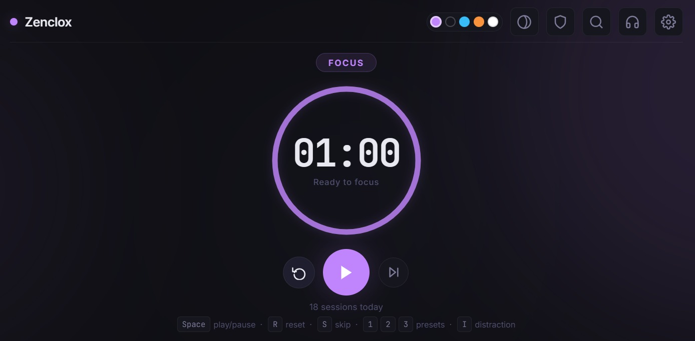
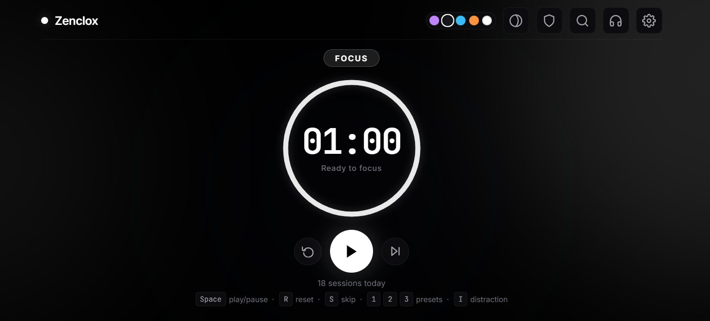
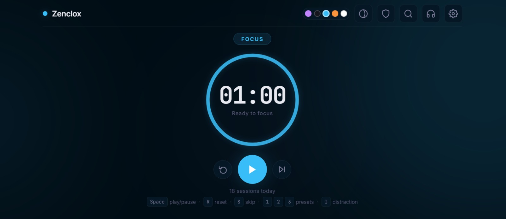
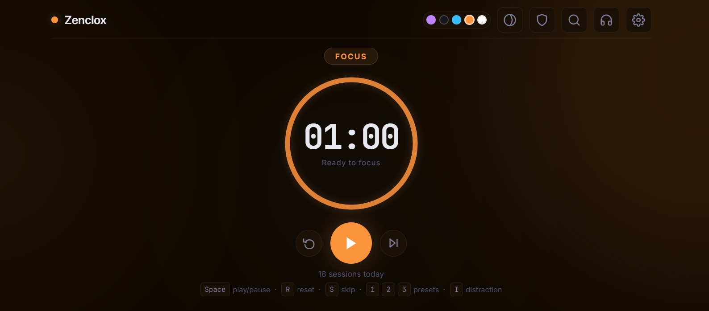
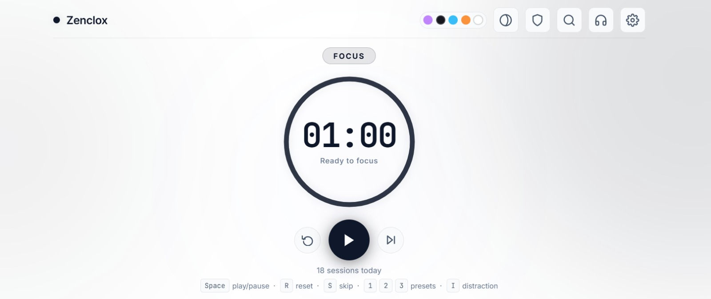
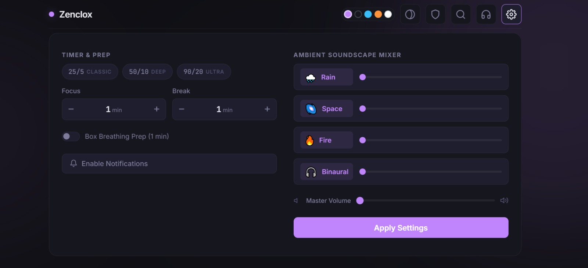
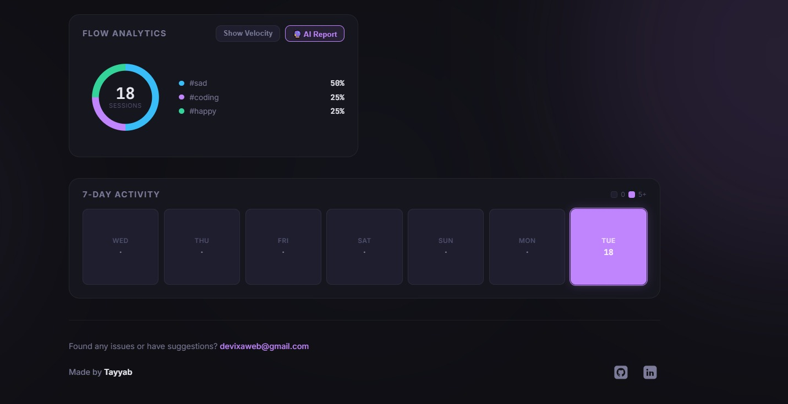
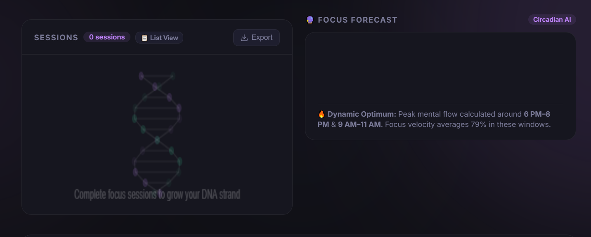

<div align="center">

# 🕐 Zenclox — Flow Timer

**A premium, distraction-free Pomodoro timer with ambient soundscapes, session DNA visualisation, AI-powered analytics, and five stunning themes.**

[](https://zenclox.vercel.app)


<br/>



*The default Void theme — violet focus ring with an ambient dark backdrop.*

</div>

---

## Screenshots

<table>
  <tr>
    <td align="center"><br/><b>🟣 Void</b> — Default dark theme</td>
    <td align="center"><br/><b>⚫ Dark</b> — Clean dark mode</td>
  </tr>
  <tr>
    <td align="center"><br/><b>🌊 Ocean</b> — Cool blue tones</td>
    <td align="center"><br/><b>🔥 Forge</b> — Warm amber energy</td>
  </tr>
  <tr>
    <td align="center"><br/><b>☀️ Light</b> — Minimal light mode</td>
    <td align="center"><br/><b>🎧 Ambient Mixer</b> — Soundscapes panel</td>
  </tr>
  <tr>
    <td align="center"><br/><b>📊 Flow Analytics</b> — Session insights</td>
    <td align="center"><br/><b>🧬 DNA View</b> — 3D session helix</td>
  </tr>
</table>

---

## Features

### Core Timer
- **Circular SVG progress ring** — depletes as time runs out; readable at a peripheral glance
- **Configurable durations** — change focus/break lengths with one-click presets: `25/5` classic, `50/10` deep, `90/20` ultra
- **Auto-cycle** — seamlessly transitions focus → break → focus when each period ends
- **Box breathing prep** — optional 1-minute guided breathing before focus sessions
- **Interruption tracker** — log distractions during focus with the `I` key; visible count on the timer

### 🎨 Five Premium Themes
Switch instantly between five curated colour palettes — the entire UI (ring, badges, glows, backgrounds) updates from a single CSS variable swap:

| Theme | Palette | Vibe |
|-------|---------|------|
| 🟣 **Void** | Violet / Emerald | Deep focus, default |
| ⚫ **Dark** | Monochrome | Clean, distraction-free |
| 🌊 **Ocean** | Cyan / Teal | Calm, fluid energy |
| 🔥 **Forge** | Amber / Gold | Intense, warm drive |
| ☀️ **Light** | Neutral / Black | Minimal, daytime |

### 🎧 Ambient Soundscape Mixer
Layered audio engine powered entirely by the **Web Audio API** — no audio files, works offline:
- **Rain** — soft rainfall ambience
- **Space** — deep cosmic hum
- **Fire** — crackling fireplace warmth
- **Binaural Beats** — focus-enhancing frequencies
- Per-channel volume sliders + master volume control

### 🧠 11 Premium Features

| # | Feature | Description |
|---|---------|-------------|
| 1 | **Time Warp Visualiser** | Timer ring scales with 3D perspective during focus; gentle breathing wave during breaks |
| 2 | **Session DNA Strand** | 3D helix canvas visualising your session history as an interactive double helix |
| 3 | **Mood Selector** | Track flow quality per session (🔥 Fire · 💙 Good · 😐 Neutral · 😤 Struggling) with gradient heatmap borders |
| 4 | **Quote Oracle** | Curated motivational quotes appear inside the timer ring after sessions |
| 5 | **Smart Break Suggestions** | Context-aware break activities based on session count and time of day |
| 6 | **Command Palette** | `Ctrl+K` spotlight search — quick access to every action, theme, and setting |
| 7 | **Wallpaper Export** | Generate and download shareable session summary wallpapers |
| 8 | **Circadian AI Predictor** | Energy curve predictions based on your historical session patterns |
| 9 | **AI Performance Report** | Comprehensive analytics with insights, trends, and personalised recommendations |
| 10 | **Zen Mode Sanctuary** | Minimal fullscreen mode — strips away all UI except the timer and soothing zen elements |
| 11 | **Spotlight Onboarding** | Guided first-visit tour highlighting every feature with animated spotlights |

### 📊 Analytics & History
- **Session log** — completed sessions with timestamps, durations, mood, and tags
- **Flow Analytics dashboard** — donut charts, velocity tracking, and tag breakdowns
- **Weekly heatmap** — visual overview of your productivity patterns
- **CSV export** — download your session data anytime
- **Auto-reset at midnight** — daily history clears automatically via `localStorage` date comparison

### ⚡ Additional Highlights
- **Streak tracking** — consecutive-day focus streaks with a 🔥 badge in the header
- **Velocity scoring** — real-time focus quality metric
- **Cinema Mode (Flow Shield)** — fullscreen overlay blocking distractions
- **PWA installable** — add to home screen on mobile, works offline via service worker
- **Browser notifications** — opt-in desktop alerts when sessions complete
- **Synthesised audio cues** — three-note ascending chime on completion (Web Audio API)
- **Fully accessible** — ARIA labels, keyboard navigation, screen-reader friendly

---

## ⌨️ Keyboard Shortcuts

| Key | Action |
|-----|--------|
| `Space` | Start / Pause |
| `R` | Reset current session |
| `S` | Skip to next mode |
| `I` | Log a distraction |
| `Z` | Toggle Zen Mode |
| `F` | Toggle Cinema Mode |
| `1` `2` `3` | Quick presets |
| `Ctrl+K` | Command Palette |
| `Esc` | Close any open panel |

---

## 🛠️ Getting Started

### No install — just open the file

```bash
# Clone the repository
git clone https://github.com/your-username/pomodoro-timer.git
cd pomodoro-timer

# Open directly in your browser
start index.html         # Windows
open index.html          # macOS
xdg-open index.html      # Linux
```

### Optional — local dev server

Recommended if you experience audio issues on `file://`:

```bash
# Using Node.js (no install needed)
npx serve .
# → http://localhost:3000

# Using Python
python -m http.server 8080
# → http://localhost:8080
```

**That's it.** No `npm install`, no build step, no bundler, no framework.

---

## 📁 Project Structure

```
pomodoro-timer/
├── index.html          # Semantic markup, ARIA labels, SVG ring, all UI
├── style.css           # Design system via CSS custom properties, animations
├── app.js              # Core timer logic, Web Audio synthesis, localStorage
├── features.js         # 11 premium feature modules (DNA, AI, Zen, etc.)
├── manifest.json       # PWA manifest for installability
├── sw.js               # Service worker — offline caching
├── favicon.png         # App icon (192×192 / 512×512)
├── screenshots/        # App screenshots for documentation
│   ├── voidmode.jpeg
│   ├── darkmode.jpeg
│   ├── oceanmode.jpeg
│   ├── forgemode.jpeg
│   ├── lightmode.jpeg
│   ├── background_music.jpeg
│   ├── flow_analytics.jpeg
│   └── dna_view.png
└── README.md
```

**Zero dependencies.** Pure HTML + CSS + JavaScript.

---

## ⚙️ How It Works

### Timer Engine
The countdown uses `setInterval` with 1-second ticks. When `remaining` reaches zero, the cycle-end handler fires — it logs the session (if focus), plays a synthesised chime, shows the flash overlay, waits 2 seconds, then flips to the opposite mode and auto-restarts.

### Colour Theming
The entire UI is driven by three CSS custom properties:

```css
--active:      /* current mode colour */
--active-glow: /* glow / shadow tint */
--active-ring: /* SVG ring stroke */
```

Switching modes swaps these values on `<body>`. Every element — ring, badge, blobs, buttons — updates automatically with zero JS DOM manipulation.

### Audio Synthesis
All sounds are generated on the fly via the Web Audio API — no audio files to load or cache:

```js
// Focus complete → three ascending notes
[523.25, 659.25, 783.99].forEach((freq, i) => {
  setTimeout(() => playTone(freq, 0.5), i * 180);
});
```

### Session Persistence
Sessions are stored in `localStorage` as JSON arrays keyed by date (`YYYY-M-D`). On load, if the stored date doesn't match today, the array is cleared — automatic midnight reset without timers or cron jobs.

---

## 🌐 Browser Support

| Browser | Version | Status |
|---------|---------|--------|
| Chrome | 120+ | ✅ Fully supported |
| Firefox | 126+ | ✅ Fully supported |
| Safari | 17+ | ✅ Fully supported |
| Edge | 120+ | ✅ Fully supported |

**Requirements:** CSS custom properties, Web Audio API, `localStorage` — all widely supported in modern browsers.

---

## 🎨 Customising

Open the ⚙️ settings panel to change durations without touching code. To change the colour palette, edit the variables at the top of `style.css`:

```css
--focus: #c084fc;   /* violet — focus mode */
--brk:   #34d399;   /* emerald — break mode */
```

Everything else picks up the change automatically.

---

<div align="center">

**Built with ❤️ using vanilla HTML, CSS, and JavaScript**

[Live Demo](https://zenclox.vercel.app) · [Report a Bug](https://github.com/your-username/pomodoro-timer/issues) · [Request a Feature](https://github.com/your-username/pomodoro-timer/issues)

</div>
